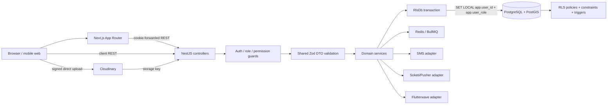
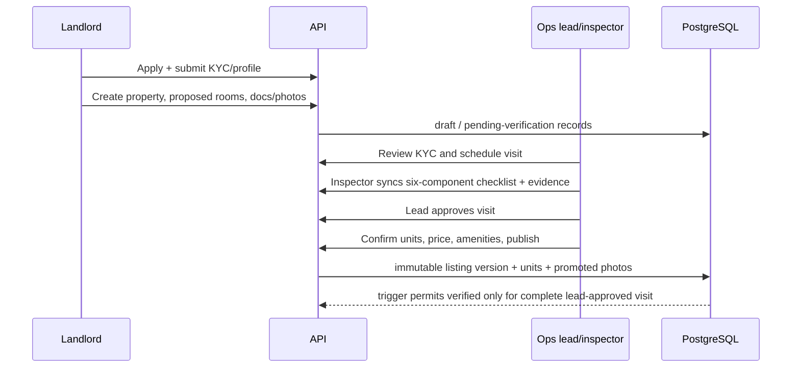
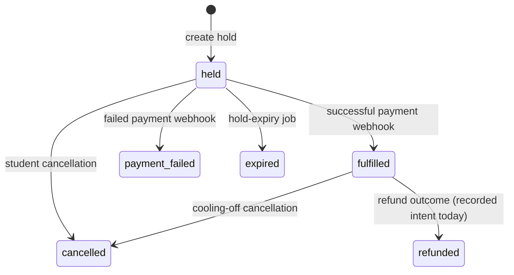

# CampusHomes Architecture Blueprint

Generated from a full prime of the project-owned runtime source, authored migrations, tests, configuration, and current working-tree changes on 2026-07-19.

## 1. Executive summary

CampusHomes is a mobile-first student-housing marketplace for Kampala. It connects students to verified hostel listings, lets landlords onboard properties, gives operations staff an offline-capable six-part inspection workflow, and supports 72-hour reservation holds paid through a UGX 5,000 reservation fee. A thin staff-administration portal and fine-grained RBAC foundation are the newest additions.

The repository is a pnpm monorepo containing:

- a Next.js web application (`apps/web`);
- a NestJS modular-monolith API (`apps/api`);
- shared Zod schemas, enums, and TypeScript types (`packages/shared`);
- shared TypeScript and ESLint configuration (`packages/config`);
- PostgreSQL/PostGIS migrations with native row-level security and integrity triggers.

The strongest architectural choice is defense in depth around data access: controller guards and shared validation feed a transaction-scoped database context, and PostgreSQL RLS is the final authorization boundary. The main production-readiness risks are in reservation/payment state transitions, staff lifecycle enforcement, incomplete external integrations, and error masking in server-rendered web pages.

## 2. Scope and inventory

The prime covered 207 authored implementation files (`.ts`, `.tsx`, `.sql`, `.css`, `.cjs`) totaling 18,154 lines, plus root/package configuration and the current source-facing design specifications. The broader non-generated project-owned text set is approximately 25,323 lines.

Inventoried but not treated as application logic:

- dependency directories and build outputs (`node_modules`, `dist`, `.next`, `.swc`);
- generated Drizzle snapshots (`apps/api/migrations/meta`, 12 files, about 952 KiB);
- the generated pnpm lockfile (about 368 KiB);
- local secrets (`.env`, `.claude/settings.local.json`);
- nested worktrees (`.worktrees`, `.superpowers`, `.claude/worktrees`);
- `OwnResourceFolder` (87 design/reference files, about 81 MiB), which is explicitly marked as non-source in `.gitignore`;
- historical implementation plans under `docs/superpowers/plans`; the corresponding design specifications and resulting source were used to understand intent and implementation.

## 3. Repository map

```text
Campus-Homes/
├── apps/
│   ├── api/
│   │   ├── migrations/        PostgreSQL schema, PostGIS, triggers, RLS, RBAC seeds
│   │   ├── scripts/           Development seed data
│   │   ├── src/
│   │   │   ├── adapters/      Messaging, payment, and realtime ports/adapters
│   │   │   ├── config/        Environment validation
│   │   │   ├── db/            Drizzle schema and transaction-scoped RLS context
│   │   │   └── modules/       Auth, listings, reservations, ops, chat, staff, etc.
│   │   └── test/              RLS and service-flow integration tests
│   └── web/
│       ├── public/            Static assets
│       └── src/
│           ├── app/           Next.js App Router route groups and pages
│           ├── components/    Shared UI, shell, chat, map, ops/offline components
│           ├── i18n/          next-intl request setup and messages
│           └── lib/           API clients, session, domain facades, IndexedDB sync
├── packages/
│   ├── config/                Shared TS/ESLint settings
│   └── shared/                Zod contracts, enums, types, public API barrel
├── docs/superpowers/          Feature design specifications and historical plans
├── graphify-out/              Generated machine-readable knowledge graph (ignored)
├── CLAUDE.md                  Active engineering/project memory
├── PRODUCT.md                 Product contract
├── DESIGN.md                  Visual and interaction system
├── FRONTEND.md                Frontend architecture guidance
└── TECH.md                    Deployment/integration notes
```

## 4. Technology stack

| Layer | Technology | Role |
|---|---|---|
| Runtime/tooling | Node.js 24, pnpm workspaces | Monorepo execution and dependency management |
| Web | Next.js 16 App Router, React 19, TypeScript | Server-rendered pages plus interactive client islands |
| Styling/UI | Tailwind CSS 4, Radix-style primitives, Lucide icons, OKLCH tokens | Mobile-first design system, dark mode, accessible components |
| Client data | Native fetch wrappers, TanStack React Query, React Hook Form | API access, caching where needed, forms |
| Maps | MapLibre GL | Listing map and geospatial browsing |
| API | NestJS 11 on Express, TypeScript | Modular HTTP API under `/api/v1` |
| Auth | Better Auth 1.6 | Phone OTP for students/landlords and email/password for staff |
| Contracts | Zod 4 + nestjs-zod | Shared runtime validation and inferred types |
| Persistence | PostgreSQL, PostGIS, Drizzle ORM, raw SQL | Relational state, geospatial search, RLS, constraints/triggers |
| Jobs/locking | BullMQ, Redis/ioredis | Hold-expiry, SLA, reverification jobs; lock optimization |
| Files/media | Cloudinary signed upload | Browser-to-cloud image/document upload |
| Messaging | Africa's Talking adapter / console fallback | OTP and operational SMS |
| Realtime | Soketi/Pusher protocol / polling fallback | Reservation-scoped chat updates |
| Payments | Flutterwave adapter / development stub | Reservation-fee checkout and webhook intake |
| Testing | Jest, jsdom, PostgreSQL integration suites | Web utilities/components, service flows, RLS guarantees |
| Deployment target | Vercel, Render, Neon, Upstash | Web, API, database/PostGIS, Redis |

## 5. Runtime architecture



Important boundary: most authenticated queries run inside `RlsDb.run(ctx, callback)`. The database transaction sets identity/role GUCs before Drizzle or raw SQL executes. Server-internal workflows use a hard-coded `service_role` context, never a value supplied by the client.

Better Auth is mounted separately under `/api/auth` before the regular JSON body parser because its webhook/handler behavior needs raw request ownership. Its database pool starts in the service context so auth infrastructure tables remain RLS-isolated.

## 6. Feature map

| Area | What is built | Principal modules/routes |
|---|---|---|
| Public discovery | Landing page, campus tiles, search/filter, MapLibre map, verified listing detail, reviews, unit categories/photos, recently viewed | web public routes; API `listings` |
| Student account | Phone OTP, profile, saved listings, reservation list/status, cancellation, move-in confirmation, messages | web student routes; API `auth`, `profile`, `reservations`, `chat` |
| Landlord account | Apply/role transition, KYC profile, property onboarding/editing, proposed rooms/amenities, documents, cover/unit photos, reservation inbox, messages | web landlord routes; API `landlords`, `listings`, `reservations`, `chat`, `uploads` |
| Verification ops | SLA queue, inspector directory, visit scheduling, offline checklist/photo capture, sync, lead approval, listing publication, KYC decisions, strikes, campus photos | web ops routes; API `ops`; IndexedDB sync manager |
| Reservations/payments | Idempotent hold request, Redis lock, DB uniqueness, checkout, verified webhook entry point, expiry, cancellation, move-in, refund records | API `reservations`, `jobs`, payment adapters |
| Chat | Reservation-derived threads, participant authorization, history, send, private-channel auth, push-or-poll updates | API/web `chat` |
| Notifications | In-app feed/read state, push-subscription storage, SMS adapter | API `notifications`, jobs |
| Staff/RBAC | Seven fine-grained roles, permission catalog, scoped/time-bound assignments, staff invite/list/deactivate, grant/revoke endpoints, audit log, thin admin UI | API `staff`, `auth/permissions`; web admin routes |
| Platform health | Health endpoint and environment validation | API `health`, config |

## 7. Main system flows

### 7.1 Request and authorization flow

1. A browser sends a Better Auth session cookie either directly to NestJS or through a Next.js server component.
2. `AuthGuard` resolves the session and attaches it to the Express request.
3. Coarse role routes use `RolesGuard`; the new staff endpoints use `PermissionsGuard`, which loads active, unexpired role assignments and permissions.
4. `nestjs-zod` validates request DTOs from `packages/shared`.
5. The service opens an `RlsDb` transaction with the session user ID and coarse role.
6. PostgreSQL applies RLS policies; constraints and triggers enforce invariants independently of application code.

### 7.2 Landlord-to-published-listing flow



The public surface reads only `verified` listings. Publication creates an immutable listing version, individual units per category, and promotes the approved visit's staged evidence into listing photos.

### 7.3 Offline inspection flow

The inspection client saves a draft and captured `File` blobs in IndexedDB. Submission changes the local record to `queued`. The sync manager requests Cloudinary signatures, uploads photos, then posts the checklist and storage keys using a client idempotency key. Online/reconnect events retry queued records. A successful sync marks the draft `synced`; failed drafts remain visible locally for diagnosis.

### 7.4 Reservation/payment flow



The nominal sequence is: client-generated idempotency key → Redis lock optimization → service-role database transaction → verified listing/unit lookup → reservation and payment rows → external checkout initiation → BullMQ expiry job → payment webhook → reservation/payment transition → chat thread/SMS. The database partial unique index is the authoritative concurrency guard.

### 7.5 Chat flow

A chat thread is created from an existing reservation and binds exactly one student and the property's landlord. REST serves history and writes. If Soketi is configured, the client authorizes and subscribes to a private thread channel; otherwise it polls every four seconds. Authorization rechecks thread participation in the database.

### 7.6 Staff/RBAC flow

The legacy five-value `users.role` enum remains the RLS branching mechanism. Seven staff role keys map onto those coarse values; active assignments join `roles → role_permissions → permissions` per request. Scopes are `platform_wide` or catchment-specific, with optional expiry. Step-up-marked permissions deliberately return HTTP 501 until MFA reverification exists. Audit events are append-only.

## 8. Data architecture

Core aggregate areas:

- Identity: `users`, `students`, `landlords`, `ops_staff`, Better Auth `sessions/accounts/verifications`.
- Property verification: `properties`, `property_documents`, `verification_visits`, `campus_photos`.
- Listings: `semesters`, `listings`, immutable `listing_versions`, `listing_photos`, `units`, `unit_photos`, `saved_listings`.
- Commerce: `reservations`, `payments`, `refunds`, `move_ins`.
- Trust: `reviews`, `landlord_strikes`, `student_flags`, `audit_log`, materialized `reputation_scores`.
- Communication: `chat_threads`, `chat_messages`, `notifications`, `notification_templates`, `push_subscriptions`.
- RBAC: `roles`, `permissions`, `role_permissions`, `user_role_assignments`, `approval_requests`.

Database-enforced invariants include positive prices/fees, rating and study-year ranges, geospatial point generation/indexing, review eligibility, three-strike suspension, append-only security surfaces, public visibility of verified listings only, and the complete six-component inspection gate for publication.

## 9. Code quality assessment

### Strengths

- Clear modular-monolith boundaries and a small, reusable adapter layer for external systems.
- Shared Zod contracts reduce API/web drift and provide runtime request validation.
- Native RLS is real defense in depth, not documentation-only; policies and adversarial integration tests cover major tables.
- Important concurrency and trust rules live in database constraints/triggers.
- Reservation and offline-inspection APIs use idempotency keys.
- Public listing queries choose explicit fields and keep payment data away from landlords.
- Strict TypeScript, ESLint, and focused comments around non-obvious security/state behavior.
- UI is coherently componentized, mobile-first, tokenized, and includes accessible labels/states.

### Structural weaknesses and debt

- `service_role` is necessarily powerful and used in several domain services; every such path must manually preserve authorization and transaction semantics.
- `apiServer()` converts missing cookies, HTTP errors, malformed upstream behavior, and outages into the same `null`, so server-rendered pages can show false empty states or redirects.
- Internal web API responses are mostly compile-time casts rather than runtime-validated responses.
- Raw SQL and Drizzle are mixed heavily; listing projections/search joins are repeated and costly to evolve.
- Test coverage is strongest at database/service boundaries but thin for complete browser journeys and the new admin UI.
- Root documentation has some drift (for example, the live suite now contains 81 API tests and 11 web tests, while `CLAUDE.md` records an earlier count).

## 10. High-priority system risks

These are codebase-level findings, not necessarily introduced by the current diff.

1. **A fulfilled unit can be reserved again.** Availability queries and the partial unique index only treat `held` as occupied. Once payment changes a reservation to `fulfilled`, the unit becomes eligible for another hold even though landlord UI treats fulfilled reservations as live.
2. **Payment-initiation failure can strand a hold.** The reservation/payment transaction commits before the external checkout call. If checkout initiation fails, the hold exists without an expiry job; replaying the idempotency key does not reconstruct a checkout URL.
3. **Refunds are recorded but not executed.** Cancellation/late-webhook paths insert pending refund rows, but no path calls the payment adapter's refund operation or processes those rows.
4. **Suspension does not revoke access.** `AuthGuard`, coarse role checks, and permission loading do not reject `users.status = suspended`; deactivation also leaves active sessions and assignments intact.
5. **Role revocation leaves the coarse role unchanged.** Revoking a fine-grained assignment does not recompute `users.role`, so coarse `RolesGuard`/RLS access can outlive the assignment.
6. **Payment webhooks do not independently verify transaction amount/currency with Flutterwave.** Signature validation is present, but provider transaction verification and expected-amount matching are absent.
7. **Hourly SLA notifications can repeat.** The hourly job has no durable deduplication marker for already-sent reminders.

## 11. Current-diff review (medium effort, read-only)

1. **The staff table displays the coarse database role, not the actual RBAC assignment.** Five distinct roles (`super_admin`, `platform_admin`, `finance_admin`, `support_admin`, `auditor`) all appear as `admin`, and scope/expiry are hidden. The new UI therefore gives administrators an inaccurate access picture.
2. **The admin shell is gated and rendered by coarse role, while each API uses fine permissions.** Finance, support, and auditor users map to coarse `admin`, so they are redirected into `/admin`, see Staff/Audit/Invite navigation, and then receive API 403s that `apiServer()` converts to empty tables. The invite control is rendered even for roles without `staff.invite`. API security remains intact, but the new portal is functionally misleading for legitimate staff roles.

No changes were applied and no PR comments were posted because `--fix` and `--comment` were not requested.

## 12. Integration readiness

| Integration | Current state |
|---|---|
| PostgreSQL/PostGIS | Fully modeled with migrations/RLS; test database must be running at the configured port |
| Redis/BullMQ | Implemented for locks and scheduled/repeating jobs |
| Cloudinary | Signed direct-upload flow implemented |
| Africa's Talking | Adapter implemented with console development fallback |
| Flutterwave | Adapter and webhook surface exist; production behavior is intentionally deferred/incomplete |
| Soketi/Pusher | Adapter exists; polling fallback works when unconfigured |
| Web push | Subscription persistence only; delivery/service worker not implemented |
| Sentry | Account/config intent documented; SDK not wired |

## 13. Verification result

- `git diff --check`: passed.
- `pnpm lint` under Node 24.13.0: passed.
- `pnpm typecheck` under Node 24.13.0: passed.
- Web Jest: 2 suites, 11 tests passed.
- API Jest: 6 suites, 81 tests discovered but not executed successfully because PostgreSQL at `127.0.0.1:54329` was not running (`ECONNREFUSED`).

## 14. Recommended order of work

1. Fix unit occupancy semantics and cover all live reservation statuses with a database-level exclusion/unique strategy and tests.
2. Make hold creation compensate for checkout-initiation failure and persist enough provider state for safe idempotent replay.
3. Implement a refund worker/state machine that actually calls and reconciles the provider.
4. Enforce active user status in auth, terminate sessions on deactivation, and reconcile coarse roles on assignment changes.
5. Return assignment role/scope data from the staff listing endpoint and make the admin shell/navigation permission-aware.
6. Replace `apiServer()`'s blanket null behavior with explicit unauthorized/not-found/upstream-error outcomes.
7. Finish payment verification, observability, push delivery, and realtime provisioning before production launch.

